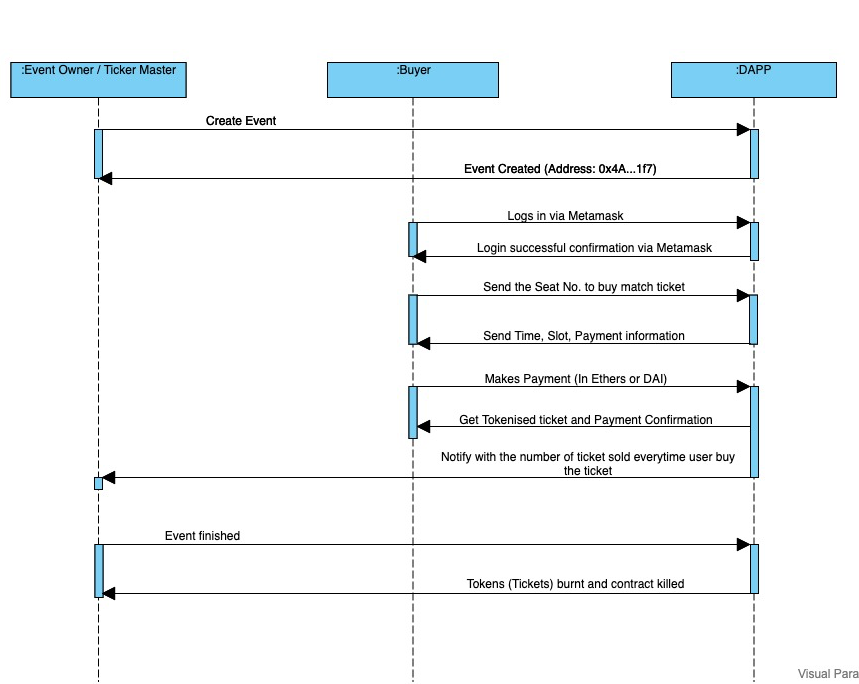

## Syetem Organization

```
Event Ticketing Token(ETT)
|
|---client-side (react front end)
|   |   package.json (displays all npm/yarn packages)
|   |
|   |---public
|   |---src
|       |   App.js (main react/jsx file)
|       |
|       |---assets (images, json files, etc)
|       |---components (components for pages)
|       |---container (container components for pages)
|       |---scripts (contains web3 code)
|
|---eth-side (solidity & etheruem code)
|   |---contracts (smart contracts)
|   |---migrations (migration code for deploying on truffle)
|   |---documentation (readme files for contracts)
|
|---documents (various non-code files)
    |--- Sequnce diagram
    |--- Flow Chart

```

## Software Used:

1. npm (package installation + react server starting)
2. truffle + ganache (local ethereum network)
3. react (front end framework)
4. web3 (connections to Metamask + ethereum network)
5. Metamask (connection point to ethereum node)
6. Remix (optional - web IDE that can connect and view deployed contract status)

## Description

Events are the popular form of an entertainment. Baseball match, football match, touring artists/concerts, world cups , small performances, conference etc. are the different types of events globally happening for entertainment. For all these events, the current traditional way of tickets is paper-based and are purchased for third party platforms which charges high percentage (approximately 27%) as an extra fee. All this further raises the questions, Can the user trust getting the ticket on fair price? Also, Is the ticket bought is original one or fake.? <br>
<br>
This project, therefore, aims to eliminate the third party/middle-man from the event organizer and customers flow using Ethereum Blockchain. The paper-based tickets will be tokenized into ETT (which are ERC-721 uniqie tokens).

## Benefits

- Increases trust between buyer(user) and seller(event organiser/ticket master).
- Based on Ethereum Network
  - Well supported and developed
- Easily sold/transferred with the record on blockchain to verify authencity.

## Business Model

1. Event Host
   - Interacts with the interface to put the tickets/tokens for sale.
2. Ticket/Token buyer
   - Interacts with interface to buy the tokens.
3. Transaction fee
   - Can be kept fixed to 3% on all transactions.

[ETT Business Model Sequence Digram]


## Data/Parameters

**_Event Organizer/ Ticket Master_**

| Name             | Type    | Structure                                   | Visibility | Purpose                                                    |
| ---------------- | ------- | ------------------------------------------- | ---------- | ---------------------------------------------------------- |
| ownerAddress     | address | N/A                                         | public     | store the address of the event owner                       |
| eventCreated     | mapping | (address ownerAddress => bool eventCreated) | public     | keep track of the event created or not                     |
| eventId          | mapping | (address ownerAddress => uint8 eventId)     | private    | keep the track of the event ids created by the event owner |
| totalTicketsSold | uint256 | N/A                                         | public     | Store the total number of tickets/tokens sold per event    |

**_Buyer_**

| Name          | Type    | Structure                                     | Visibility | Purpose                                                                                             |
| ------------- | ------- | --------------------------------------------- | ---------- | --------------------------------------------------------------------------------------------------- |
| buyerAddress  | address | N/A                                           | public     | store the address of the buyer                                                                      |
| ticketsBought | mapping | (address buyerAddress => uint8 ticketsBought) |            | keeps the track of number of tickets bought per buyer                                               |
| tokenId       | mapping | `(address buyerAddress => uint256 tokenId)`   |            | keep the track of ticket Number (seat number) in the form of token (ERC-721)                        |
| maxLimit      | mapping | `(address buyerAddress => uint8 maxLimit)`    | public     | keep the track on the limit of number of tickets can be purchased (MAX LIMIT = 10 tickets (tokens)) |

## Functions

| Function name | Input Parameters   | Return Parameters                     | Called By      | Description                                                                                        |
| ------------- | ------------------ | ------------------------------------- | -------------- | -------------------------------------------------------------------------------------------------- |
| isOwner       | N/A                | `bool`                                | User/ Owner    | To check the event owner address                                                                   |
| registerUser  | N/A                | `bytes32 userId`                      | User/Owner     | To register the user logged in for the first time and creates the userId for new users registered. |
| getUserId     | `address _address` | `bytes32 userId`                      | Logged in User | Get the user id for the current logged in user                                                     |
| getAllUserId  | N/A                | `bytes32[] userIdList`                | Only Owner     | Get all the user ids for all users                                                                 |
| createEvent   | N/A                | `bool eventCreatedStatus`             | Only Owner     | Create the event                                                                                   |
| mintToken     | `uint256 tokenId`  | `bool mintedTokenStatus`              | Only Owner     | Generate the tokens(on the basis of seat numbers) for the event                                    |
| selectSeat    | `uint256 tokenId`  | `uint256 tokenId, uint256 tokenPrice` | Only User      | Token Details including price of the token                                                         |
| makePayment   | `uint256 tokenId`  | `bool paymentSuccessful`              | Only user      | Payment made corresponding to the token buyer wants to purchase                                    |
