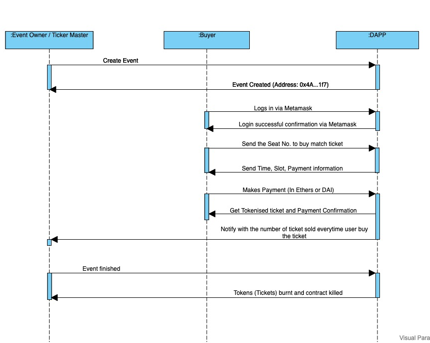
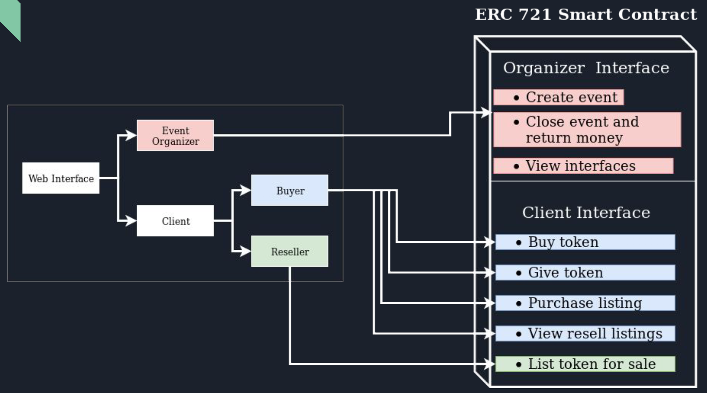
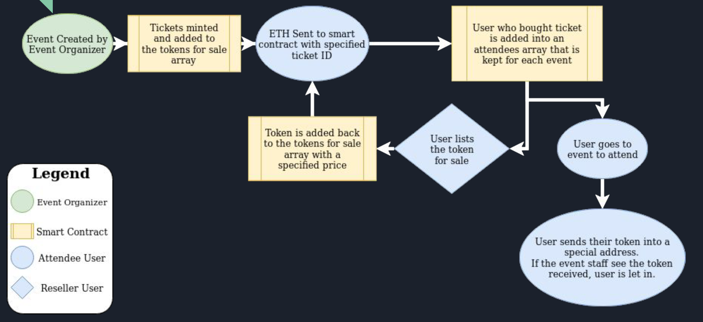
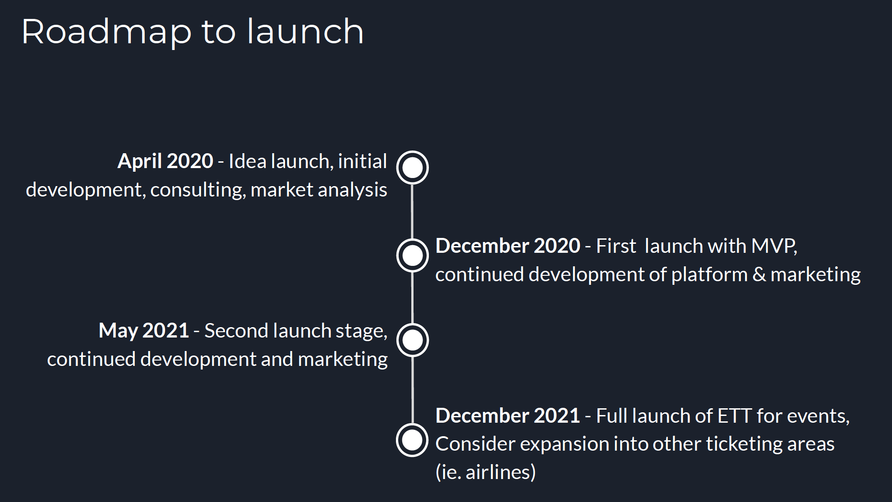

# EventChain - An Event ticket tokenization dAPP

- An Ethereum Network based decentralized application
- [EventChain dApp Presentation](https://docs.google.com/presentation/d/11Qm5qsFzRSOpsVPe_WsVk5OMBx7txxNhNeXUIb0buLo/edit?usp=sharing)

### **Developer Details:**

**_Name:_** _Deepanshu Gupta_ <br>
**_Student Id:_** 101253525

# Description

Events are basically the popular form of the Entertainment. In almost all Large sporting and cultural events, there is traditional paper based ticket system or an electronic version of paper based ticket system for the users to buy the event tickets.<br>
<br> So, the problem is purchasing these tickets from the middlemen or any third party organisation those charges approximately 27% of the cost as an extra fee (In the form of Transaction fee). Moreover, the authenticity of  the ticket is not guranteed too. Hence, How can user trust on getting the fair price for the ticket and on its authenticity.?
<br><br>
This project aims on solving this problem by using Blockchain Technology which eliminates the middlemen. The proposed solution is '_Using Tokens (ERC721) as tickets_' and using Ethereum Network. These paper-based tickets will be tokenized into ETT (which are ERC-721 unique tokens).

_Note:_ This project is a simple POC to demostrate the flow of eliminating the middlemen which includes simple setup by  which an ``Event Organiser`` can create an Event by inputing Event Details and ``User`` can buy the ticket and in return user will receive the ``tokenId`` corresponding to the ``seat no`` selected for booking.

# Business Model

1. Event Host
   - Interacts with the dApp to create the event.
2. Ticket/Token buyer
   - Interacts with dApp to buy the tickets (tokens).
3. Transaction fee
   - Can be kept fixed to 3% on all transactions.

### *EventChain Business Model Sequence Digram*


# Benefits

- Increases trust between buyer(user) and seller(event organiser/ticket master).
- Based on Ethereum Network
  - Well supported and developed
- Easily sold/transferred with the record on blockchain to verify authencity.

# Token Model created for simple Interface



# Simple Flow for creation, (re)sale, and use of ETT Tokens



# Timeline/Implementation



# Syetem Organization

```
Event Ticketing Token(ETT)
|
|---client-side (react front end)
|   |   package.json (displays all npm/yarn packages)
|   |
|   |---public
|   |---src
|       |   index.js (setting the baseUrl)
|       |   App.js (main react/jsx file)
|       |   
|       |---assets (images, json files, etc)
|       |---components (components for pages)
|       |---container (container components for pages)
|       |---contracts (.json files of contracts)
|       |---hoc (layout/ navigation bar setting)
|       |---scripts (contains web3 code)
|       |---store (set redux paramteres to use globally)
|
|---eth-side (solidity & etheruem code)
|   |---contracts (smart contracts)
|   |---migrations (migration code for deploying contracts using truffle)
|   |---documentation (readme/functions files for contracts)
|
|---documents (various non-code files)
    |    images
    |       |---- Sequence Diagram
    |       |---- Flow Diagram
    |       |---- Roadmap to launch
    |       |---- Simple token model Interface (ERC721 based)
    |--- EventChain - ETT(Event Ticket Tokenization) Slide Deck
```

# Software Used

1. npm (package installation + react server starting)
2. truffle + ganache (local ethereum network)
3. react (front end framework)
4. web3 (connections to Metamask + ethereum network)
5. Metamask (connection point to ethereum node)
6. Remix (optional - web IDE that can connect and view deployed contract status)

## Data/Parameters

**_Event Organizer/ Ticket Master_**

| Name             | Type    | Structure                                   | Visibility | Purpose                                                    |
| ---------------- | ------- | ------------------------------------------- | ---------- | ---------------------------------------------------------- |
| eventOwner     | address | N/A                                         | public     | store the address of the event owner                       |
| eventCreated     | mapping | (address ownerAddress => bool eventCreated) | public     | keep track of the event created or not                     |
|  eventOwnerWallet  |  address  |  N/A | public payable | address of event owner where ethers will be received from user|
| eventId          | mapping | (address ownerAddress => uint8 eventId)     | private    | keep the track of the event ids created by the event owner |
| eventName | string | N/A | public | Store the name of the event.<br> *Note:* As its only POC, mostly the variables are kept for single event |
| maximumSeats | uint256 | N/A | private | Store the maximum number of seats for the event corresponding to event Owner  of the event. |
| tokenPrice | uint256 | N/A | public | Store the price of token for the event |
| totalTicketsSold | uint256 | N/A                                         | public     | Store the total number of tickets/tokens sold per event    |
| tokenName | string | N/A | public | Store the  name of token |

**_Buyer_**

| Name          | Type    | Structure                                     | Visibility | Purpose                                                                                             |
| ------------- | ------- | --------------------------------------------- | ---------- | --------------------------------------------------------------------------------------------------- |
| buyerAddress  | address | N/A                                           | public     | store the address of the buyer                                                                      |
| ticketsBought | mapping | (address buyerAddress => uint8 ticketsBought) |            | keeps the track of number of tickets bought per buyer                                               |
| tokenId       | mapping | `(address buyerAddress => uint256 tokenId)`   |            | keep the track of ticket Number (seat number) in the form of token (ERC-721)                        |
| maxLimit      | mapping | `(address buyerAddress => uint8 maxLimit)`    | public     | keep the track on the limit of number of tickets can be purchased (MAX LIMIT = 10 tickets (tokens)) |


## Functions

| Function name | Function visibility | Input Parameters | Return Parameters | Function Type | Modifier/Called By | Description |
| ------------- | ----|-------------- | ------------------------------------- | -------|------- | -------------------------------------------------------------------------------------------------- |
| createEvent | external | `uint256 maximumSeats` | `bool eventCreated, address eventTicketingTokenAddress, uint8 eventId` | N/A | onlyEventOwner | - creates the event (lets say small music concert) every time owner wants to create<br> - Will have maximum limit on the total number of seats available for the event <br> - deploys the `EventTicketingToken` contract <br> - notifies the event owner about the event creation <br> - creates the mapping of `event created` with the `event owner` address|
| maximumSeats | public | N/A | `uint256 maximumSeats` | view | N/A| - fetch the value of maximum number of tokens sold |
|constructor | public | N/A | N/A | N/A | N/A | - set the owner of the event |
| buyToken | public |`uint256 tokenId` | `uint256 tokenId, bool tokenBought` | payable | onlyBuyer | - Used to buy the tickets (which are basically now treated as tokens) for the event.<br> - Mint the token, buyer is willing to buy.<br> - Increment the total number of tokens sold. <br> - Notifies the buyer with the token details (like price)<br> **Note: tokenId will be basically corresponds to the seatNumber.** |
| isEventOwner | public | N/A | `bool isEventOwner` | view | N/A | - Used to check whether the current login in user is event owner or buyer |
| getMaximumSeats | public | N/A| `uint256 maximumSeats` | N/A | N/A | Used to get the maximum number of seats for the event to display to user |

**Few `Future scope` functions**
| Function name | Input Parameters   | Return Parameters      | Modifier/Called By | Description                                                                                        |
| ------------- | ------------------ | ---------------------- | ------------------ | -------------------------------------------------------------------------------------------------- |
| registerUser  | N/A                | `bytes32 userId`       | User/Owner         | To register the user logged in for the first time and creates the userId for new users registered. |
| getUserId     | `address _address` | `bytes32 userId`       | Logged in User     | Get the user id for the current logged in user                                                     |
| getAllUserId  | N/A                | `bytes32[] userIdList` | Only Owner         | Get all the user ids for all users                                                                 |

# Steps to run this dApp

1. Run `ganache-cli -d` locally
2. Run git clone `https://github.com/deepcrazy/dappII_project_ETT.git`
3. cd dappII_project_ETT/eth-side
4. Run `truffle migrate`
5. Copy the  EventTicketingToken contract address from the output of previous step.
6. Paste this copied contract address into `../client-side/src/scripts/eventTicketingTokenInfo.js` file at `Line: 7` by replacing the existing one.
7. cd ../clide-side
8. Run `npm install`
9. Run `npm start`

# Notes
1. Most of the functionality is implemented by considering 1 event and not multiple events as part of POC.
2. Validations are restricted to tokenIds only and other validations are kept for future scope.

# Future scope

1. Buring of tokens after the event gets finished (not implemented as of now.)
2. Input more details while creating the event like `event location, event day and time, event guest(optional) etc.`
3. User should be able to see all the events available created via dapp.
4. User should able to book multiple seat instead of one seat(which is a current behaviour)
5. User  should be able to see his own balance after making the payment.
6. User should be able to see `Order history`.
7. Event Organiser should get notified `No of total tickets sold` everytime buyer purchase the token.


# Resources

* [React application creation and implementation](https://reactjs.org/docs/create-a-new-react-app.html)
* [Material-UI Installation and usage](https://material-ui.com/getting-started/installation/)
* [Redux - For Global states in React App](https://redux.js.org/introduction/getting-started)
* [Tools Used - Remix](https://remix.ethereum.org/)
* [ERC721 - openZeppelin open source code](https://github.com/OpenZeppelin/openzeppelin-contracts/blob/master/contracts/token/ERC721/ERC721.sol)
* [Smart contract coding ways](https://arctouch.com/blog/how-to-develop-smart-contracts/)
* [Smart contract interaction using web3](https://web3js.readthedocs.io/en/v1.2.0/web3-eth-contract.html)