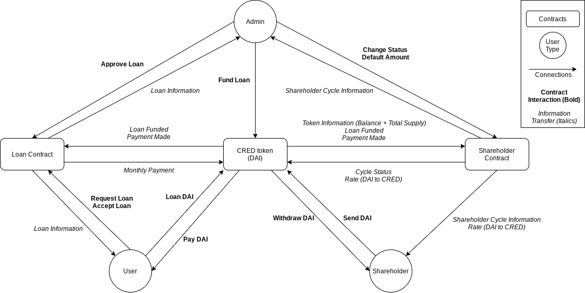

# Ethereum Code

### Loan Contract
[Documentation](./documentation/LoanContract.md)  
[Smart Contract](./contracts/LoanContract.sol)  

### ShareholderContract
[Documentation](./documentation/ShareholderContract.md)  
[Smart Contract](./contracts/shareHolderContract.sol)

### CRED Token Contract
[Documentation](./documentation/TokenContract.md)  
[Smart Contract](./contracts/credToken.sol)

### Contract Connections

_Currently, user must approve the amount first in the DAI contract - most likely using a web3 call_

#### Loan Flow
1. User submits a loan request to the loan contract
1. Admin gets information and can approve through loan contract
1. User gets information and can accept through loan contract
1. Admin gets information through loan contract, and sends the fund loan call to the token contract.
1. Token contract checks that shareholder contract status = 1. If loan is funded, the token contact sends the loan funded information to the loan contract and gets the total payment amount and loan amount to send to shareholder contract. Then it sends DAI to the user. If not funded, update information in the loan contract.
1. User pays back DAI to the token contract. Token contract checks it against the required monthly payment (revert if incorrect), then updates the loan contract details.

#### Shareholder Flow
1. Admin and shareholder get information through the shareholder contract (continous).
1. If shareholder contract status is 0, shareholder can purchase CRED token for the rate in the shareholder contract. Then the token contract updates the deployable amount in shareholder contract.
1. Admin is able to change the status when necessary.
1. Loans are able to be funded at this point (when shareholder contract status = 1).
1. Once conditions are met (specified [here](./documentation/ShareholderContract.md)), admin is able to change status again.
1. Shareholders are able to return tokens to withdraw DAI for the latest rate in the shareholder contract.
